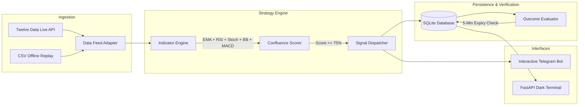

# TB: Algorithmic Confluence Trading Engine & Autonomous Verification Terminal

> **B.Tech Mini-Project** | Department of Computer Science & Engineering  
> *Maharana Pratap Group of Institutions*

---

## 📌 Executive Summary

**Project TB** is an asynchronous algorithmic trading engine and automated trade verification system designed for binary forex markets. Addressing the high failure rate and false signals of traditional single-indicator scripts, Project TB implements a **multi-factor confluence scoring model** combining trend, momentum, volatility exhaustion, and crossover detection to make weighted, high-probability trade decisions.

The platform couples autonomous signal generation with **empirical verification**: every signal is logged to a local relational SQLite database ($P_0$), automatically tracked through a 5-minute expiry window, and resolved against live market price ($P_1$) to generate auditable, real-time win rates.



---

## 🚀 Key Features

1. **Multi-Factor Confluence Engine**:
   - **Trend Filter**: 200 EMA & 50 EMA macro direction.
   - **Momentum Filter**: 14-period Relative Strength Index (RSI).
   - **Immediate Shift**: Stochastic RSI bullish/bearish crossover.
   - **Volatility Exhaustion**: Bollinger Bands outer envelope touches (20, 2).
   - **Confidence Scoring**: Signals only execute when combined confluence $\ge 75\%$.

2. **Automated Trade Outcome Tracking**:
   - Stores entry price ($P_0$) as `PENDING`.
   - Asynchronously queries market price ($P_1$) at the 5-minute expiry mark.
   - Auto-resolves trade outcomes to `WIN`, `LOSS`, or `TIE` with zero human bias.

3. **Two-Way Interactive Telegram Bot**:
   - Sends formatted signal cards with exact algorithmic reasoning.
   - Responds to on-demand commands: `/status`, `/stats`, and `/chart <PAIR>`.
   - Generates and delivers candlestick chart overlays directly to the chat using `mplfinance`.

4. **Real-Time Web Terminal (FastAPI + Chart.js)**:
   - Dark-mode glassmorphic interface at `http://localhost:8000`.
   - Live KPI cards: Win Rate %, Verified Wins, Verified Losses, Pending Trades.
   - Outcome distribution doughnut chart and execution log table with 5-second polling.

5. **Presentation Failsafe (Offline Demo Mode)**:
   - Includes a `--demo` flag utilizing offline historical candle data.
   - Guarantees 100% presentation uptime during college evaluations, immune to campus Wi-Fi instability or API rate limits.

---

## 📂 Project Architecture

```text
trading_signal_bot/
├── run_bot.py                 # Central asynchronous orchestrator
├── dashboard.py               # FastAPI real-time analytics server
├── requirements.txt           # Consolidated project dependencies
├── .env.example               # Secure environment variables template
├── .gitignore                 # Excludes local databases, logs, and API secrets
├── templates/
│   └── index.html             # Glassmorphic web dashboard (Tailwind + Chart.js)
├── data/
│   └── historical/
│       └── eurusd_sample.csv  # Seeded historical dataset for offline demo
├── src/
│   ├── config.py              # Typed settings dataclass (.env / ini.env fallback)
│   ├── database/
│   │   ├── __init__.py
│   │   └── models.py          # SQLite schema & query methods
│   ├── data_feed/
│   │   ├── __init__.py
│   │   ├── base.py            # Abstract Base Class (MarketDataFeed)
│   │   ├── twelve_data.py     # Live feed with 8.0s token-bucket rate limiter
│   │   └── replay_feed.py     # Deterministic offline replay provider
│   ├── strategy/
│   │   ├── __init__.py
│   │   ├── indicators.py      # Technical indicator calculator (pandas-ta)
│   │   └── confluence.py      # Multi-factor confidence scoring logic
│   ├── tracker/
│   │   ├── __init__.py
│   │   └── outcome_eval.py    # Expiry resolution & win-rate metrics engine
│   └── notifier/
│       ├── __init__.py
│       ├── chart_generator.py # mplfinance candlestick visualizer
│       └── telegram_bot.py    # Bi-directional Telegram application
```

---

## 🛠️ Installation & Setup

### 1. Clone & Set Up Virtual Environment

```bash
git clone https://github.com/believerbl/TB.git
cd TB

# Create and activate virtual environment
python -m venv myenv
source myenv/Scripts/activate     # Windows PowerShell: .\myenv\Scripts\Activate.ps1
```

### 2. Install Dependencies

```bash
pip install -r requirements.txt
```

### 3. Configure Credentials

Copy the environment template:
```bash
cp .env.example .env
```

Edit `.env` with your API credentials:
```ini
TWELVE_DATA_API_KEY=your_twelve_data_api_key
TELEGRAM_BOT_TOKEN=your_telegram_bot_token
CHAT_ID=your_chat_id
CONFIDENCE_THRESHOLD=75
```

---

## 🖥️ Running the Project

### Tab 1: Run the Trading Engine

* **Offline Demo Mode (Default, Recommended for College Viva)**:
  ```bash
  python run_bot.py
  ```

* **Live Market Mode**:
  ```bash
  python run_bot.py --live
  ```

### Tab 2: Launch the Web Dashboard

```bash
python dashboard.py
```
Open **[http://localhost:8000](http://localhost:8000)** in your browser to view the real-time analytics terminal.

---

## 🤖 Telegram Bot Commands

| Command | Action |
| :--- | :--- |
| `/start` | Registers chat session and displays operational menu |
| `/status` | Displays system health, data feed mode, and active watchlist |
| `/stats` | Fetches live win rate, total verified trades, and outcome breakdown |
| `/chart EUR/USD` | Renders a candlestick chart with EMA and Bollinger Band overlays |

---

## 📊 Technical Stack

| Domain | Technology |
| :--- | :--- |
| **Language & Concurrency** | Python 3.10+, `asyncio` |
| **Backend Web Server** | FastAPI, Uvicorn, Starlette |
| **Frontend UI** | HTML5, Tailwind CSS, Chart.js, Jinja2 |
| **Persistence** | SQLite3 |
| **Data Analysis** | Pandas, NumPy, pandas-ta |
| **Visualization** | mplfinance, Matplotlib |
| **Messaging** | python-telegram-bot (v21+ Async) |
